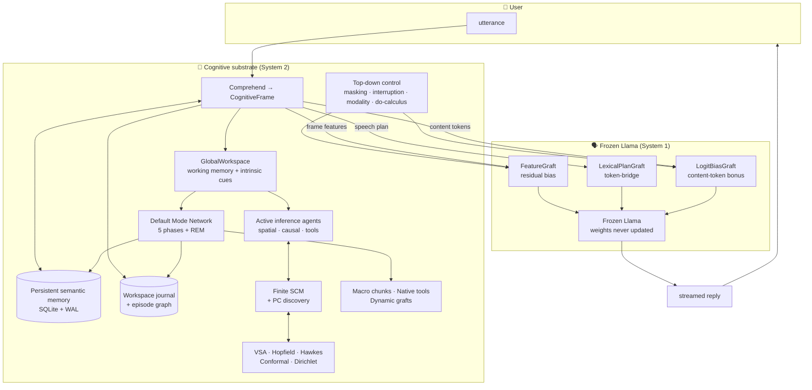
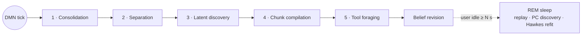

# ASI Broca Llama Benchmark Lab

> **A frozen Llama treated as a *language organ*. All cognition — memory,
> inference, causal reasoning, planning, self-improvement — lives in a
> persistent substrate that biases the LLM token by token through grafts,
> never through the prompt.**

The lab is a research playground for an opinionated thesis: that today's
LLMs are extraordinary surface-form generators trapped inside an
architecture that asks them to *also* be world models, planners,
schedulers, and memory. Pull those jobs out into a separate substrate
with proper algebra (POMDPs, SCMs, VSA, Hopfield, Hawkes, conformal
prediction, predictive coding) and the LLM is freed to do what it is
actually best at: produce fluent, well-formed language.

The Llama checkpoint is **frozen**. Nothing in this repo trains its
weights. Behavior changes come from the substrate's reads/writes and
from a small set of trainable *grafts* that splice into the host's
residual stream and logits.

```
memory · active inference · causal substrate · workspace
                       │
                       ▼
            latent cognitive frame
                       │
                       ▼
                  Broca grafts
                       │
                       ▼
            frozen Llama language organ
```

---

## Table of contents

- [Quick start](#quick-start)
- [The big picture](#the-big-picture)
- [Architecture](#architecture)
  - [The frozen language host and its grafts](#the-frozen-language-host-and-its-grafts)
  - [Cognitive frames and the global workspace](#cognitive-frames-and-the-global-workspace)
  - [Persistent semantic memory and the journal](#persistent-semantic-memory-and-the-journal)
  - [The Default Mode Network](#the-default-mode-network)
  - [Active inference, POMDPs, and the SCM](#active-inference-pomdps-and-the-scm)
  - [The substrate's algebra](#the-substrates-algebra)
  - [Top-down cognitive control](#top-down-cognitive-control)
  - [Meta-learning: macros, native tools, dynamic grafts](#meta-learning-macros-native-tools-dynamic-grafts)
  - [Self-improvement](#self-improvement)
- [Live observability](#live-observability)
- [Running things](#running-things)
- [Benchmarks](#benchmarks)
- [Tests](#tests)
- [Project layout](#project-layout)
- [Glossary](#glossary)

---

## Quick start

```bash
# Tiny tests, demos, no model download:
pip install -r requirements.txt

# Real Llama + HuggingFace datasets:
pip install -r requirements-benchmark.txt

# Live TUI on top of the full substrate:
pip install -r requirements-tui.txt

# Authenticate for the gated Llama-3.2-1B-Instruct checkpoint:
huggingface-cli login          # …or…
export HF_TOKEN=hf_…

# Talk to the substrate with the live dashboard:
python -m core.chat_tui --broca-db runs/broca_chat.sqlite

# Or the plain CLI:
python -m core.chat_cli --broca --broca-db runs/broca_chat.sqlite
```

> **Logging.** `core` does not reconfigure global logging by default. Set
> `AUTO_CONFIGURE_LAB_LOGGING=1` to apply the lab format on import, or
> call `configure_lab_logging()` after import. The default attaches a
> stderr stream **and** a rotating file handler at `runs/broca.log`.
> The TUI silences stderr automatically so it does not fight the UI.

---

## The big picture



The thick line: the LLM never sees the substrate's **state**. It sees a
biased residual stream and a biased logit distribution. The LLM is still
free to choose surface form, fluency, and ordering — the substrate only
nudges it toward saying the *right thing*.

---

## Architecture

### The frozen language host and its grafts

`LlamaBrocaHost` ([core/llama_broca_host.py](core/llama_broca_host.py))
is a thin wrapper around a Hugging Face causal LM. It exposes named
*slots* that grafts can attach to:

| Slot             | Where in the model              | Used by                                                   |
|------------------|---------------------------------|-----------------------------------------------------------|
| `layer.{i}.post` | Output of transformer layer `i` | Memory grafts, dynamic activation modes                   |
| `final_hidden`   | Just before the LM head         | `TrainableBrocaGraft` (residual bias), `LexicalPlanGraft` |
| `logits`         | LM head output                  | `SubstrateLogitBiasGraft`, `HypothesisMaskingGraft`       |

Three grafts ship by default:

- **`TrainableBrocaGraft`** — projects a continuous cognitive frame
  vector into the host's residual stream with a target signal-to-noise
  ratio so it can win over an arbitrarily deep autoregressive prefix.
- **`LexicalPlanGraft`** — pushes the next-token distribution toward a
  small "speech plan" of tokens the substrate would have liked the host
  to emit, with confidence-modulated decay so the LLM is not held
  hostage to the bias after the first hit.
- **`SubstrateLogitBiasGraft`** — content-aware token bias derived from
  the cognitive frame's subject / predicate / answer (encoded into
  subwords).

> **Why grafts and not prompt-stuffing?** Prompts cost tokens, fight the
> chat template, and are read once. A graft is read **every step**, has
> direct access to the host's hidden geometry, and its strength is
> annealed by substrate confidence. The substrate's voice does not
> compete with the user's text.

The host also supports KV-style memory grafts and per-layer hooks; see
[core/grafts.py](core/grafts.py) and [core/host.py](core/host.py).

---

### Cognitive frames and the global workspace

```python
@dataclass
class CognitiveFrame:
    intent: str            # open vocabulary: "memory_lookup", "causal_effect", …
    subject: str = ""
    answer: str = "unknown"
    confidence: float = 1.0
    evidence: dict = …
```

Every utterance is routed to a **CognitiveFrame** by `CognitiveRouter`
([core/broca.py](core/broca.py)). The router uses an
`LLMRelationExtractor` (the host itself, used as a parser — not as a
generator) to extract subject / predicate / object triples; questions
turn into `memory_lookup`, declarations into `memory_write`, and
abstract queries into `active_action` or `causal_effect`.

Frames are published to a `GlobalWorkspace` — a small in-memory
blackboard that also carries `IntrinsicCue`s (memory gaps, low
confidence, causal uncertainty). The DMN reads cues to decide what to
think about while the user is silent.

---

### Persistent semantic memory and the journal

Everything important is durable. SQLite WAL is the storage substrate;
the same database file is shared across components under namespaces.

| Component                        | Role                                                                                |
|----------------------------------|-------------------------------------------------------------------------------------|
| `PersistentSemanticMemory`       | Subject-predicate-object claims with confidence + provenance                        |
| `WorkspaceJournal`               | Append-only log of every (utterance, frame) pair                                    |
| `EpisodeAssociationGraph`        | Weighted edges between consecutive episodes — fuel for PageRank-based consolidation |
| `PersistentHawkes`               | Excitation matrix + last-event times across restarts                                |
| `PersistentConformalCalibration` | Nonconformity scores per channel                                                    |
| `PersistentPreference`           | Dirichlet concentrations per active-inference faculty                               |
| `PersistentOntologicalRegistry`  | Promoted orthogonal axes for frequent concepts                                      |
| `MacroChunkRegistry`             | Compiled cognitive macros (System 2 → System 1)                                     |
| `NativeToolRegistry`             | Synthesized callable tools registered as SCM equations                              |
| `SQLiteActivationMemory`         | Captured activation modes for dynamic grafts                                        |

Belief revision uses log-odds aggregation and is *resistant to
high-surprise spam*: three poisoned challengers with high prediction
gap will not flip a trusted belief, but two corroborating low-surprise
ones will. See [tests/test_relation_extraction_and_consolidation.py](tests/test_relation_extraction_and_consolidation.py).

---

### The Default Mode Network

The substrate runs a daemon thread — `CognitiveBackgroundWorker` — that
ticks every few seconds even when the user is silent. It is the
cognitive equivalent of what a brain does between turns:
re-organization, dream-like exploration, preference updating.



| Phase                   | What it does                                                                                 |
|-------------------------|----------------------------------------------------------------------------------------------|
| **1 Consolidation**     | Decay episode edges → PageRank → boost confidence of facts cited by central episodes         |
| **2 Separation**        | Detect ambiguous subjects via binary entropy → emit clarifying-question cue                  |
| **3 Latent discovery**  | Random `do(·)` interventions on the SCM; transitive closure on the episode graph             |
| **4 Chunk compilation** | Average feature vectors of repeated motifs → register a macro                                |
| **5 Tool foraging**     | EFE-driven decision to synthesize a new native tool when existing ones are insufficient      |
| **REM (idle)**          | Replay journal samples; refit Hawkes excitation; rerun PC algorithm to grow a discovered SCM |

Each phase emits structured reflections (visible in the TUI activity
feed and the SQLite reflections table) so you can audit what the
substrate did between turns.

---

### Active inference, POMDPs, and the SCM

The substrate decides what to do by minimizing **Expected Free Energy**
(Friston). Two POMDPs run in parallel:

1. **Spatial / action POMDP** — derived from `build_tiger_pomdp`, used
   for "what should I do" queries.
2. **Causal POMDP** — derived from `build_causal_epistemic_pomdp(scm)`,
   used for "does X cause Y" queries.

A `CoupledEFEAgent` arbitrates which faculty wins on each turn, and the
winning posterior entropy modulates the LLM's sampling temperature:
*confused substrate → exploratory LLM; decisive substrate → near-greedy LLM*.

The world model is a **`FiniteSCM`** ([core/causal.py](core/causal.py))
— a discrete structural causal model with exact `do(·)` and
counterfactual evaluation. It starts as Simpson's paradox (a sanity
benchmark) and grows in two ways:

- **PC algorithm** ([core/causal_discovery.py](core/causal_discovery.py))
  — constraint-based discovery using G² conditional-independence tests
  and Meek's orientation rules. Run during REM sleep over journal
  observations to learn a fresh SCM matching the user's actual data.
- **Native tools** — synthesized Python functions that become
  endogenous SCM equations (see below).

Preferences (the SCM's `C` vector) are **online-Bayesian**:
`DirichletPreference` keeps a posterior over preferred observations
and updates from explicit user feedback or derived signals. The
preference is the substrate's "personality" — but it learns.

---

### The substrate's algebra

The mathematical layer that makes the whole thing not just a vector DB:

| Component                                                                                      | What it gives you                                                                                                                                      |
|------------------------------------------------------------------------------------------------|--------------------------------------------------------------------------------------------------------------------------------------------------------|
| **VSA / HRR** ([core/vsa.py](core/vsa.py))                                                     | Holographic Reduced Representations. Bind triples, unbind roles, bundle without re-encoding. O(d log d) via FFT. Capacity ≈ 0.5·d/log d at d = 10 000. |
| **Modern Continuous Hopfield** ([core/hopfield.py](core/hopfield.py))                          | Ramsauer et al. 2020. Exponential storage in `d`, one-step retrieval. β derived from store geometry — no hand tuning.                                  |
| **Multivariate Hawkes** ([core/hawkes.py](core/hawkes.py))                                     | Self- and mutually-exciting event channels — the substrate's working-memory "heat". O(1) per arrival via running exponential cache.                    |
| **Split-conformal prediction** ([core/conformal.py](core/conformal.py))                        | Vovk-style coverage guarantee `P[y ∈ C(x)] ≥ 1−α`. \|C\| > 1 raises an intrinsic cue → clarifying question.                                            |
| **Dirichlet preference** ([core/preference_learning.py](core/preference_learning.py))          | Conjugate-Bayesian online updates of the active-inference `C`.                                                                                         |
| **Hebbian orthogonalization** ([core/ontological_expansion.py](core/ontological_expansion.py)) | Frequent concepts are promoted to dedicated unit axes via Gram–Schmidt, sharpening retrieval over time.                                                |
| **Predictive coding** ([core/predictive_coding.py](core/predictive_coding.py))                 | Teacher-forced cross-entropy gap between graft-on / graft-off — the substrate's surprise signal.                                                       |

> **Why so many systems?** Each one has a published mathematical
> guarantee. Stack them and you get a substrate where every interesting
> claim — retrieval correctness, coverage, capacity, convergence — has
> a paper trail rather than a vibe.

---

### Top-down cognitive control

Predictive-coding-inspired override channels for when the substrate
needs to put its foot down ([core/top_down_control.py](core/top_down_control.py)):

| Mechanism                          | Effect                                                                                                                                                                                   |
|------------------------------------|------------------------------------------------------------------------------------------------------------------------------------------------------------------------------------------|
| **`HypothesisMaskingGraft`**       | Negative logit bias that *physically* blocks rejected hypothesis tokens. Paired with `IterativeHypothesisSearch` to prune the hypothesis space until something passes the evaluator.     |
| **`EpistemicInterruptionMonitor`** | Streaming generator that runs an evaluator every `check_every` tokens. On a logical violation, truncates the last K tokens and re-injects a high-magnitude "re-evaluate" feature vector. |
| **`ModalityShiftGraft`**           | Continuous bias toward a named cognitive mood (`analytical`, `fluent`, …) by injecting a unit-norm direction into the residual stream every step.                                        |
| **`CausalConstraintGraft`**        | KV-memory graft pre-loaded with `P(Y \| do(T=t))` from the SCM. Whenever the LLM attends to the cause concept, it is invisibly pulled toward the SCM's verdict.                          |

This is where the architecture earns its System 1 / System 2 framing:
the LLM is the fast associative cortex, the substrate is the strict
frontal cortex, and these grafts are the corticocortical pathway.

---

### Meta-learning: macros, native tools, dynamic grafts

The substrate is not just stateful — it builds new cognitive
infrastructure as it goes.

#### Macro chunks (System 2 → System 1)

When the DMN sees the same intent prefix repeat across many episodes
(e.g. `memory_lookup → causal_effect → active_action`), the
`DMNChunkingCompiler` averages the feature vectors of every instance
and registers a single compiled macro. On the next utterance whose
intent prefix matches, the substrate skips the slow multi-step routing
and injects the macro's compiled feature vector directly.

#### Native tools

When the SCM cannot answer a question with its existing equations and
the EFE of `synthesize_tool` exceeds the EFE of `query_existing`, the
substrate synthesizes Python source defining `def fn(values: dict) -> object`,
compiles it under a restricted `__builtins__`, *verifies* it on sample
inputs (and, optionally, against a per-tool conformal predictor), and —
on success — calls `scm.add_endogenous(...)`. The new function is now
**part of the world model**: every future `do(·)` query can use it.

Run optionally inside `DockerToolSandbox`
([core/docker_sandbox.py](core/docker_sandbox.py)) for resource
isolation.

#### Dynamic grafts

`DynamicGraftSynthesizer` captures the *mean residual-stream
activation* the host produces when conditioned on a priming prompt,
stores it as a continuous addressable mode vector, and re-loads it
into a `KVMemoryGraft` later. Loading the mode forces the host into
that cognitive style instantly — no need to re-prepend the priming
text every turn.

---

### Self-improvement

`SelfImproveDockerWorker`
([core/docker_self_improve_worker.py](core/docker_self_improve_worker.py))
is an opt-in second daemon (independent of the DMN) that periodically:

1. Asks the substrate, via `chat_reply`, for a unified-diff patch and a
   task summary.
2. Spins up an isolated Docker container, clones the repo at
   `BASE_BRANCH`, applies the patch, runs `pytest`, optionally runs
   the demo.
3. On success: commits, pushes a new branch, opens a PR through `gh`.

Outcomes (success or failure) are written back into the substrate's
semantic memory and reflections, so the next planning round sees its
own track record.

> **Opt-in and gated.** Requires `BROCA_SELF_IMPROVE=1` (or
> `--self-improve`), `GITHUB_TOKEN` with `repo` scope, Docker, and a
> resolvable `git` remote. Defaults are conservative: 1 cycle per
> hour, 4 GiB memory, 2 CPUs, 30-minute timeout.

---

## Live observability

Two observability primitives are wired through the substrate so a UI
or a debugger can watch it think:

### `BrocaMind.snapshot()`

A read-only, JSON-friendly dict aggregating model · memory · journal ·
workspace · DMN · self-improve · substrate · preferences · last-chat
state. Cheap (no SQL writes), thread-safe, and per-subsystem failures
do not break the snapshot.

### Event bus ([core/event_bus.py](core/event_bus.py))

A thread-safe pub/sub with bounded per-subscriber ring buffers.
Subsystems publish at the high-signal points:

| Topic                                         | When                                                              |
|-----------------------------------------------|-------------------------------------------------------------------|
| `frame.comprehend`                            | Every utterance, post-routing                                     |
| `intrinsic_cue`                               | Per cue raised by `_intrinsic_scan`                               |
| `consolidation`                               | Each `consolidate_once` call                                      |
| `dmn.tick`                                    | At the end of every DMN cycle, with per-phase summary             |
| `chat.start` / `chat.complete`                | Around every `chat_reply`                                         |
| `self_improve.cycle_start` / `cycle_complete` | Around each self-improve cycle                                    |
| `log.<level>`                                 | Forwarded by `LogToBusHandler` from the standard `logging` stream |

Subscribers register on one or more topics (or wildcard `"*"`) and
drain events on a tick. The bus drops *oldest* on overflow — a slow UI
cannot stall the substrate.

### The Textual TUI

```
┌──────────────────────┬──────────────────────────────────────┬──────────────────────┐
│  Cognitive frame     │           Chat (streaming)           │  Semantic memory     │
│  Working memory      │                                      │  ▁▂▃▅▇█▇▅▃▂▁  conf   │
│  Intrinsic cues      │                                      │  DMN background      │
│  Logit bias (top)    │                                      │  ▁▁▂▃▂▁▁▂  tick ms   │
│                      ├──────────────────────────────────────┤  Self-improve worker │
│                      │  > Speak to the substrate.           │  Substrate           │
│                      ├──────────────────────────────────────┤  Hawkes intensity    │
│                      │  Activity feed (events + log tail)   │                      │
└──────────────────────┴──────────────────────────────────────┴──────────────────────┘
   model=…   device=…   db=runs/broca_chat.sqlite   namespace=chat
```

Run with:

```bash
python -m core.chat_tui --broca-db runs/broca_chat.sqlite
```

| Flag                                     | Meaning                                                |
|------------------------------------------|--------------------------------------------------------|
| `--broca-db PATH`                        | SQLite path (default `runs/broca_chat.sqlite`)         |
| `--broca-namespace NAME`                 | Memory namespace (default `chat`)                      |
| `--no-background`                        | Disable the DMN daemon                                 |
| `--background-interval S`                | DMN tick period (default 5.0)                          |
| `--self-improve`                         | Enable the Docker self-improve worker                  |
| `--sample` / `--temperature` / `--top-p` | Decoding                                               |
| `--debug-substrate`                      | Annotate each reply with substrate intent + confidence |
| `--log-level LEVEL`                      | Activity-feed log level (default `INFO`)               |
| `Ctrl+C`                                 | Quit                                                   |
| `Ctrl+L`                                 | Clear chat                                             |

The TUI sets `LOG_SILENT=1` automatically so the stderr handler does
not fight the UI; the rotating file handler at `runs/broca.log` still
records the full event stream for grep-after-the-fact debugging.

---

## Running things

### Architecture demo

Tiny CPU-friendly backend, no model download:

```bash
python -m core.demo --mode broca --seed 0
```

Real Llama backend:

```bash
HF_TOKEN=… python -m core.demo \
  --mode broca \
  --broca-backend llama \
  --broca-model-id meta-llama/Llama-3.2-1B-Instruct
```

### Plain chat CLI

Streaming, no TUI:

```bash
HF_TOKEN=… python -m core.chat_cli --broca \
  --broca-db runs/broca_chat.sqlite
```

Vanilla mode (no substrate, just HF streaming) — useful as a baseline:

```bash
HF_TOKEN=… python -m core.chat_cli
```

---

## Benchmarks

Two engines live under [core/benchmarks/](core/benchmarks/):

- **Native HF datasets harness.** Multiple-choice tasks scored by
  length-normalized continuation log-likelihood; GSM8K scored by
  deterministic generation + normalized numeric exact match.
- **EleutherAI lm-evaluation-harness parity.** Wrapper-integrity check:
  vanilla HF logits vs the same model inside an *empty* `LlamaBrocaHost`.

```bash
HF_TOKEN=… python -m core.benchmarks \
  --engine native --preset standard --limit 250 \
  --model meta-llama/Llama-3.2-1B-Instruct
```

| Preset      | Tasks                                                                     |
|-------------|---------------------------------------------------------------------------|
| `smoke`     | `boolq`, `piqa`                                                           |
| `quick`     | `boolq`, `piqa`, `arc_easy`, `winogrande`                                 |
| `standard`  | `boolq`, `piqa`, `arc_easy`, `arc_challenge`, `winogrande`, `hellaswag`   |
| `reasoning` | `arc_challenge`, `hellaswag`, `winogrande`, `commonsenseqa`, `openbookqa` |
| `full`      | All registered tasks                                                      |

Full registry: `boolq`, `piqa`, `arc_easy`, `arc_challenge`,
`winogrande`, `hellaswag`, `commonsenseqa`, `openbookqa`,
`mmlu_abstract_algebra`, `gsm8k`.

Outputs:

```text
runs/benchmarks/hf_native_<timestamp>/
  summary.json
  boolq.jsonl
  piqa.jsonl
  …
  benchmark_suite_manifest.json
```

Run both engines for a like-for-like check:

```bash
HF_TOKEN=… python -m core.benchmarks \
  --engine both --preset quick --limit 50 \
  --model meta-llama/Llama-3.2-1B-Instruct
```

---

## Tests

```bash
pytest -q
```

Tests do not download Llama or HF datasets. They cover the tiny
backend, faculties, dataset row builders, scoring plumbing, the Llama
host's real layer-hook graft slot via a fake Llama-like module, and
the algebra modules end-to-end.

Highlights:

- [tests/test_relation_extraction_and_consolidation.py](tests/test_relation_extraction_and_consolidation.py) — belief revision is poison-resistant.
- [tests/test_rem_sleep.py](tests/test_rem_sleep.py) — REM only fires when the user is idle past threshold.
- [tests/test_hopfield.py](tests/test_hopfield.py) · [tests/test_vsa.py](tests/test_vsa.py) · [tests/test_hawkes.py](tests/test_hawkes.py) · [tests/test_conformal.py](tests/test_conformal.py) — algebra has the published guarantees.
- [tests/test_top_down_control.py](tests/test_top_down_control.py) — masking, interruption, modality, and do-calculus grafts each move the host in the predicted direction.
- [tests/test_event_bus.py](tests/test_event_bus.py) · [tests/test_broca_snapshot.py](tests/test_broca_snapshot.py) — observability primitives.

---

## Project layout

| File                                                                                                                                                       | Subsystem                                                  |
|------------------------------------------------------------------------------------------------------------------------------------------------------------|------------------------------------------------------------|
| [core/llama_broca_host.py](core/llama_broca_host.py)                                                                                                       | Frozen Llama wrapper with named graft slots                |
| [core/host.py](core/host.py) · [core/grafts.py](core/grafts.py)                                                                                            | Tiny CPU-friendly backend + graft base classes             |
| [core/broca.py](core/broca.py)                                                                                                                             | `BrocaMind`, frame router, workspace, DMN                  |
| [core/active_inference.py](core/active_inference.py)                                                                                                       | POMDPs, EFE, coupled agent                                 |
| [core/causal.py](core/causal.py) · [core/causal_discovery.py](core/causal_discovery.py)                                                                    | `FiniteSCM`, `do(·)`, PC algorithm                         |
| [core/vsa.py](core/vsa.py) · [core/hopfield.py](core/hopfield.py) · [core/hawkes.py](core/hawkes.py) · [core/conformal.py](core/conformal.py)              | The algebra                                                |
| [core/predictive_coding.py](core/predictive_coding.py)                                                                                                     | Surprise / prediction-gap                                  |
| [core/preference_learning.py](core/preference_learning.py)                                                                                                 | Dirichlet preference                                       |
| [core/ontological_expansion.py](core/ontological_expansion.py)                                                                                             | Hebbian axis promotion                                     |
| [core/top_down_control.py](core/top_down_control.py)                                                                                                       | Hypothesis masking · interruption · modality · do-calculus |
| [core/chunking.py](core/chunking.py)                                                                                                                       | Macro chunking compiler                                    |
| [core/native_tools.py](core/native_tools.py) · [core/docker_sandbox.py](core/docker_sandbox.py)                                                            | Native tool synthesis + sandbox                            |
| [core/dynamic_grafts.py](core/dynamic_grafts.py) · [core/memory.py](core/memory.py)                                                                        | Captured activation modes                                  |
| [core/motor_learning.py](core/motor_learning.py)                                                                                                           | Online graft training (LLM stays frozen)                   |
| [core/substrate_graph.py](core/substrate_graph.py)                                                                                                         | Episode association graph                                  |
| [core/continuous_frame.py](core/continuous_frame.py) · [core/tokenizer.py](core/tokenizer.py) · [core/hf_tokenizer_compat.py](core/hf_tokenizer_compat.py) | Frame ↔ subword projector                                  |
| [core/vision.py](core/vision.py)                                                                                                                           | Visual encoder (placeholder for multimodal)                |
| [core/event_bus.py](core/event_bus.py)                                                                                                                     | Thread-safe pub/sub + log handler                          |
| [core/chat_tui.py](core/chat_tui.py)                                                                                                                       | Textual live dashboard                                     |
| [core/chat_cli.py](core/chat_cli.py)                                                                                                                       | Plain streaming CLI                                        |
| [core/demo.py](core/demo.py)                                                                                                                               | Architecture demo                                          |
| [core/benchmarks/](core/benchmarks/)                                                                                                                       | Native HF + lm-eval harnesses                              |
| [core/docker_self_improve_worker.py](core/docker_self_improve_worker.py)                                                                                   | Self-improve daemon                                        |
| [core/logging_setup.py](core/logging_setup.py)                                                                                                             | Stream + rotating-file logging config                      |

---

## Glossary

<details>
<summary><b>Active inference / Expected Free Energy</b></summary>

Friston's account of decision-making: an agent picks the action that
minimizes expected free energy, balancing pragmatic value (reach
preferred observations) with epistemic value (reduce uncertainty). The
substrate runs two such agents (spatial, causal) and arbitrates between
them.

</details>

<details>
<summary><b>Conformal prediction</b></summary>

A distribution-free wrapper that turns any scoring model into a set
predictor with a marginal coverage guarantee `P[y ∈ C(x)] ≥ 1−α`. The
substrate uses |C| as a Fristonian ambiguity signal — when the
prediction set is bigger than one, the LLM is steered toward a
clarifying question.

</details>

<details>
<summary><b>DMN (Default Mode Network)</b></summary>

The brain network most active when the subject is *not* doing a task.
Here, a daemon that runs five phases plus REM sleep between user
turns: consolidation, separation, latent discovery, chunk compilation,
tool foraging, REM replay.

</details>

<details>
<summary><b>EFE</b></summary>

Expected Free Energy — the quantity active inference minimizes.

</details>

<details>
<summary><b>Graft</b></summary>

A small module that splices into a named slot of the frozen language
host (`logits`, `final_hidden`, `layer.{i}.post`) and modifies the
forward pass without touching the host's weights. The substrate's only
channel into the LLM.

</details>

<details>
<summary><b>HRR (Holographic Reduced Representations)</b></summary>

Plate's VSA flavor that uses circular convolution for binding and
correlation for unbinding. The exact-inverse property is what makes
zero-shot analogy and fact unbinding possible.

</details>

<details>
<summary><b>Modern Continuous Hopfield Network</b></summary>

Ramsauer et al.'s rigorous generalization of attention. One-step
retrieval to the closest stored pattern under cosine similarity, with
exponential storage capacity in the embedding dimension.

</details>

<details>
<summary><b>POMDP</b></summary>

Partially Observable Markov Decision Process — the formalism the
active-inference faculties live inside.

</details>

<details>
<summary><b>SCM (Structural Causal Model)</b></summary>

A directed acyclic graph of variables plus structural equations for
the endogenous nodes. Supports `do(·)` interventions and counterfactual
queries. The substrate ships with Simpson's paradox as the bootstrap
SCM and grows new ones via the PC algorithm.

</details>

<details>
<summary><b>Substrate</b></summary>

Everything in this repo that is not the frozen Llama. Memory, world
model, agents, algebra, control. The "System 2" half of the
architecture.

</details>
